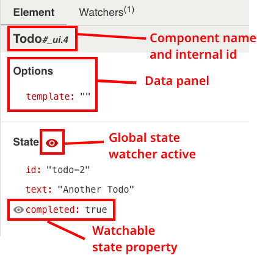

# Yuzu Inspector (WIP)

This Chrome extension lets you inspect and track changes to Yuzu Components in a webpage.


## Installation

(WIP)

## Usage

In order to use this extension you need to enable [yuzu's development tools](https://dwightjack.github.io/yuzu/#/packages/yuzu/?id=developer-tools) on the JavaScript main entrypoint of the page.

```js
import { Component, devtools } from 'yuzu';

devtools(Component); // enable development tools
```

**Note**: this extension will work in development mode only (`(process.env.NODE_ENV !== 'production'`).

When detected, a new panel called _Yuzu_ will be added to Chrome's development tools window.

### Component Tree Panel

The panel on the left will let you navigate the component tree.


The currently selected component instance will be stored as the `$yuzu0` variable on the global object (`window`). To inspect its state in the Chrome console run:

```js
$yuzu0.state;
```

### Component Inspection Panel

When you select a component on the left panel, its options and state will be shown on the right.



By clicking on the _eye_ icon that appears by hovering the left edge of a state's property, Yuzu Inspector will watch that properties changes and log them to the Chrome console.

You can watch the entire state by selecting the _eye_ icon on the right of the panel's title (**Note**: If you watch the entire state, every other property state watcher will be removed).

## Development

```
git clone https://github.com/dwightjack/yuzu-devtools
cd yuzu-devtools
yarn
yarn start
```

## Build from source

The following commands will generated a builded extension inside the `yuzu-devtools/dist` folder.

```
git clone https://github.com/dwightjack/yuzu-devtools
cd yuzu-devtools
yarn
yarn release
```
